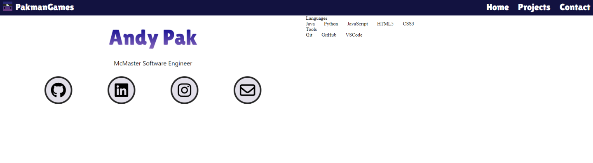
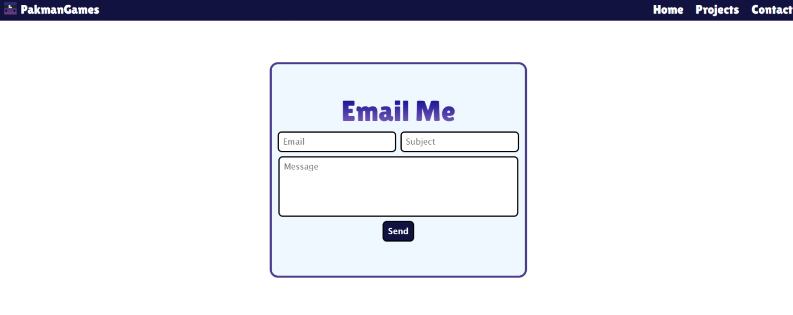

# Portfolio v1

This is my unfinished version 1 of my portfolio.  
It was originally created with just JavaScript, HTML/CSS, but as I got to styling I wanted to implement Tailwind CSS to speed up development, which is what led me to start over but using a framework like Next.js from the very beginning.

#### That's what led me to create [Portfolio v2](https://github.com/PakmanGames/portfolio-v2)

Here's a preview of what the portfolio looks like:



Contact page uses code from EmailJS:  
```
<script type="text/javascript"
        src="https://cdn.jsdelivr.net/npm/@emailjs/browser@4/dist/email.min.js">
</script>
<script type="text/javascript">
   (function(){
      emailjs.init({
        publicKey: "YOUR_PUBLIC_KEY",
      });
   })();
</script>
```  
It also uses a file called `key.js` to store the keys, which include the publicKey to send the email, the service key to send by Gmail, and the template key for the email format. These values can all be found on the EmailJS dashboard.